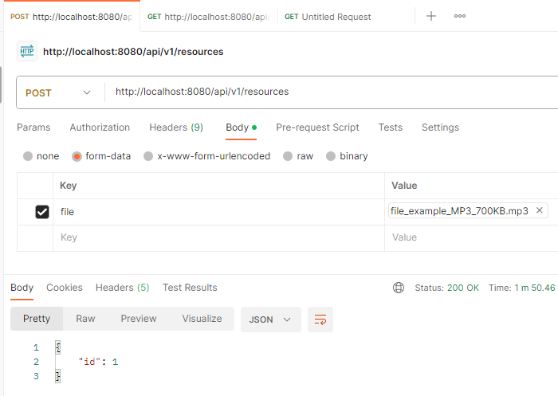
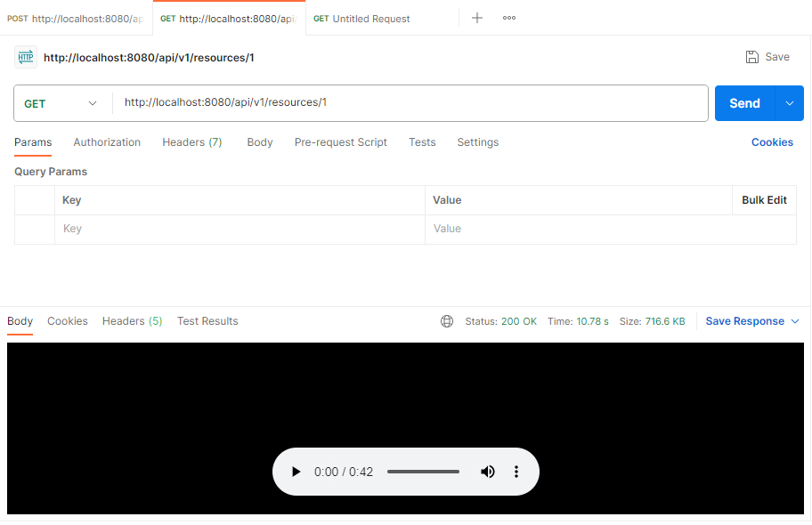
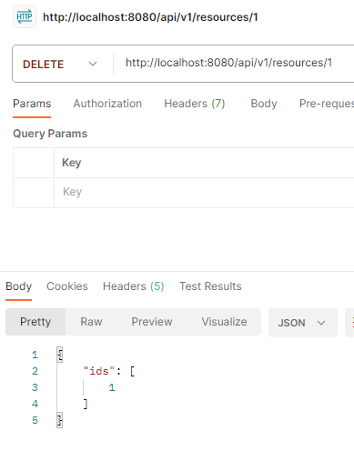
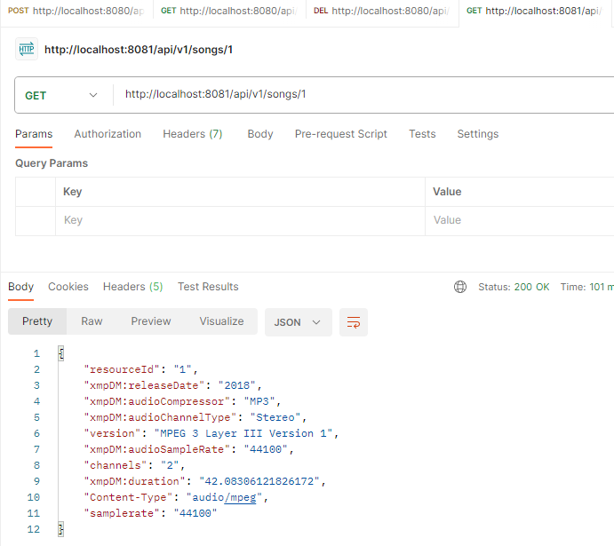
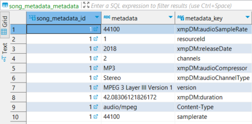
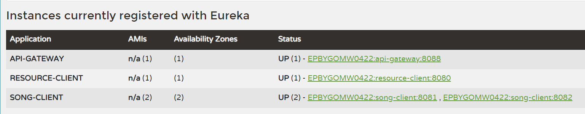
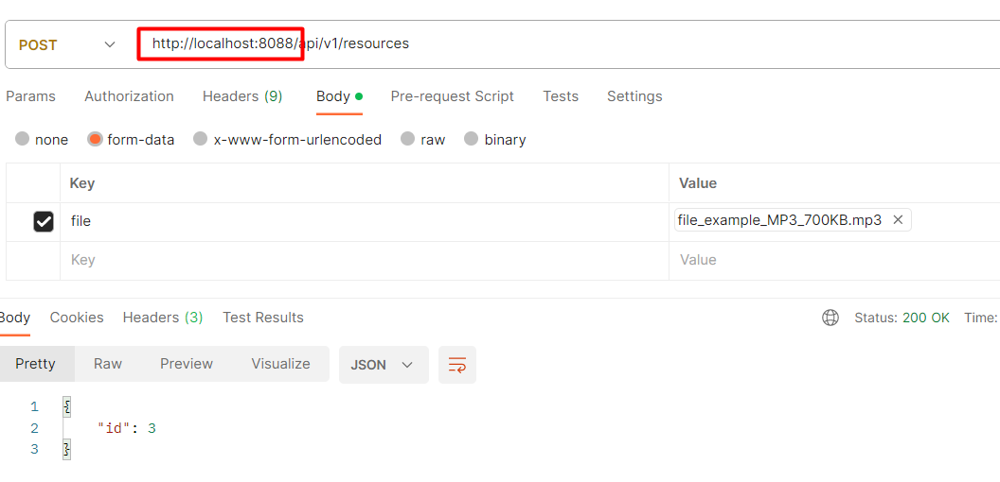

# course_microservice_task1
## Task1
In this module you will need to create base structure of microservices system.
During this task you need to implement the next two services:

Resource Service
Song Service

For a Resource Service, it is recommended to implement a service with CRUD operations for processing mp3 files.
Service definition could be next: ... 

When uploading a mp3 file, the Resource Service should process the file in this way:

Extract file metadata. An external library can be used for this purpose.(e.g. Apache Tika).
Store mp3 file to the underlying database of the service as Blob.
Invoke Song Service to save mp3 file metadata.

For the Song Service, it is recommended to implement a simple CRUD service to manage the song record (metadata).
The service should provide the ability to manage some metadata about the songs (artist, album, etc.).
Make sure the service is still available over HTTP.
Service definition could be next: ...

## Task1_Solution
The project consists of two module: for resource and song applications.
compose.yml sets up two Postgresql DB containers for each service.
/resources directory contains an example of an MP3 file.

Test cases:
1. Create a Resource:

2. Get the Resource by id:

3. Delete the Resource by id:

4. Metadata:

Same, database view:

An example of an integration test is included as well.

## Task 2
### TL;DR
Create Dockerfile, build
Create DockerCompose, compose everything together

## Task 2. Solution
Created naive Docker files for each module.
Build commands (I use Podman):
podman build . -t resource-local:1.0
podman build . -t song-local:1.0 

Created compose.yml.
Starting command (dash is used as a separator because of Podman again):
docker-compose up

The rest of the testing is as in task1

## Task 3
### TL;DR
Add Eureka Service Registry.
Implement this:

## Task 3. Solution
Added 2 more components: service-registry and api-gateway.
service-registry is a Eureka Service Registry:

API Gateway is used to direct request based on the url path and also (in case of 'song' microservice) to perform load balancing\
(which is an integral part of Spring Cloud; activated with the use of lb:// pseudo-protocol in the API Gateway configuration. \
Also, 'resource' microservice no longer makes call directly to 'song' microservice, but via API Gateway).\
After the changes, the functionality remain intact. The initial request now is made to API Gateway endpoint:

As for the orchestration, changed a bit a build process:
podman build ./resource -t resource:latest
podman build ./song -t song:latest
podman build ./discovery-service -t discovery-service:latest
podman build ./api-gateway -t api-gateway:latest

In compose.yml file, introduced two new services, set the dependency on discovery-service components for all its clients.\
The notable difference, is that 'resource' and 'song' microservices does not have port mappings and just 'expose' their \
ports for the usage inside the local network only.

In total, started discovery-service, api-gateway, resource, 2 song, 2 postgres db. With some delay, the functionality \
still works as expected.